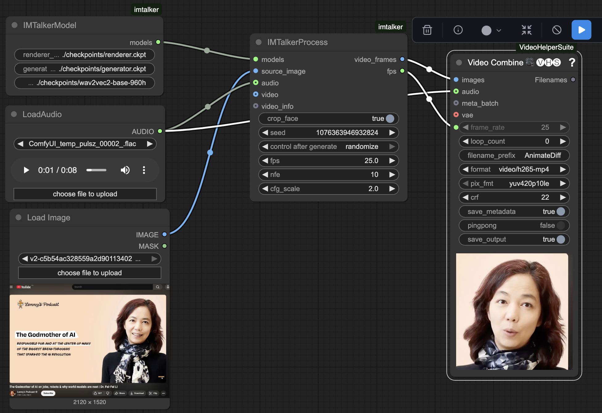
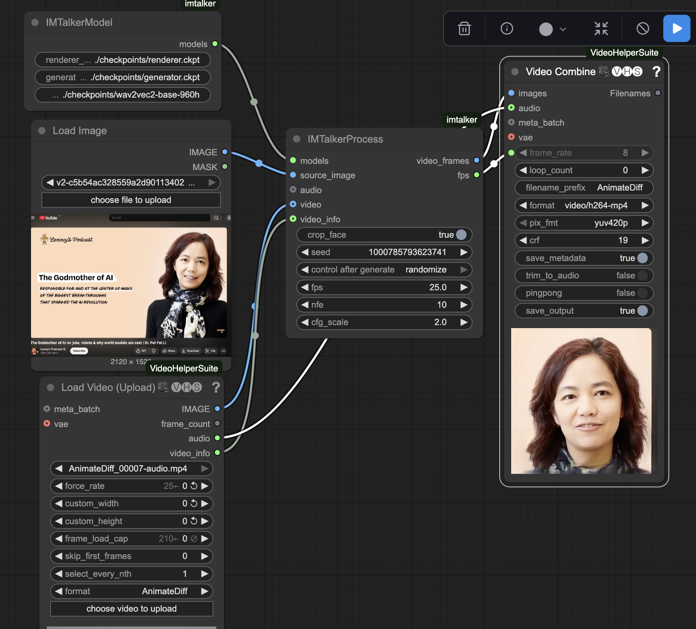

# IMTalker ComfyUI
A ComfyUI plugin for [IMTalker](https://github.com/bigai-nlco/IMTalker), an audio-driven talking face generation model that creates realistic facial animations from audio input.


## Installation
In the `./ComfyUI/custom_nodes` directory, run the following:
```bash
git clone https://github.com/benda1989/imtalker-comfyui.git
cd imtalker-comfyui
pip install -r requirements.txt
conda install -c conda-forge ffmpeg 
```
 
## Model Setup
Download the required model checkpoints and place them in the `ComfyUI/models` directory:

```
ComfyUI/models/
├── checkpoints/
│   ├── renderer.ckpt
│   ├── generator.ckpt
│   └── wav2vec2-base-960h/
│       ├── config.json
│       ├── pytorch_model.bin
│       ├── preprocessor_config.json
│       └── feature_extractor_config.json
```

The models will be automatically downloaded from [Hugging Face](https://huggingface.co/cbsjtu01/IMTalker) on first use.

## Example Workflows

### Audio-Driven Generation


### Video-Driven Generation  



## Other Requirements
- **ComfyUI**: Latest version
- **ComfyUI-VideoHelperSuite**: For video loading/saving
- **CUDA**: Recommended for GPU acceleration
- **FFmpeg**: Required for video processing